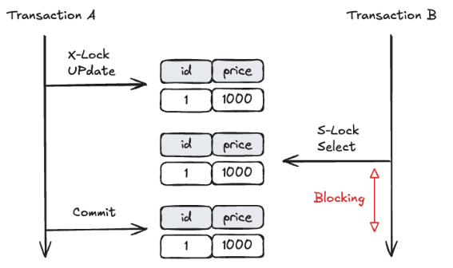
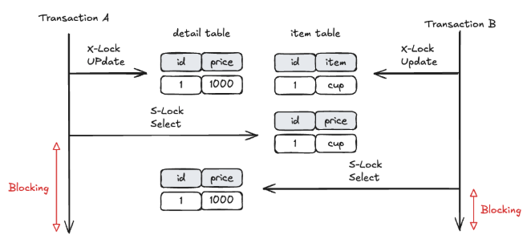

대부분의 애플리케이션에서 데이터 관리는 빼놓을 수 없죠 ! 그래서 오늘은 데이터베이스 Lock에 대해 알아보려고합니다.

## ❓Lock이란 ?

Lock의 정의는 DB의 일관성과 무결성을 유지하기 위해 트랜잭션의 순차적 진행을 보장할 수 있는 직렬화 장치입니다.
즉, **트랜잭션 처리의 순차성을 보장하기 위한 방법**이라고 생각하시면 됩니다.

Lock의 종류는 <strong>공유 Lock(Shared Lock, Read Lock, S-Lock), 배타 Lock(Exclusive Lock, Write Lock, X-Lock)</strong>로 나뉩니다.

## 🔎 공유 Lock(Shared Lock, Read Lock, S-Lock)

공유 Lock은 데이터 읽기 작업에 사용되는 Lock입니다.
공유 Lock은 공유 Lock끼리는 동시에 접근이 가능합니다.
하나의 세션에서 읽기 작업을 수행할 때, 다른 세션에서 해당 데이터를 읽어도 데이터의 정합성은 지켜지기 때문에 다른 세션의 **공유 Lock을 막을 이유는 없습니다.**

하지만 하나의 세션에서 읽기 작업을 수행할 때, 다른 세션에서 해당 데이터에 쓰기 작업을 수행한다면
기존 세션의 작업 결과가 달라질 수 있기 때문에 데이터 정합성이 지켜지지 않으므로 **다른 세션의 배타 Lock 획득을 막습니다.**

## ✍️ 배타 Lock(Exclusive Lock, Write Lock, X-Lock)

배타 Lock은 데이터를 변경할 때 사용되며, 트랜잭션이 완료될 때까지 유지됩니다.
하나의 세션에서 쓰기 작업을 수행할 때, 다른 세션에서 해당 데이터를 읽거나 쓰면 데이터 정합성이 깨질 수 있습니다.
따라서 **다른 세션의 공유 Lock, 배타 Lock 획득을 막습니다.**

## 🧱 블로킹(Blocking)

Lock을 이야기할 때 블로킹에 대한 내용은 빠질 수가 없습니다.
블로킹은 **Lock간의 경합이 발생하여 특정 트랜잭션이 작업을 진행하지 못하고 대기하는 상태**를 의미합니다.
블로킹을 해소하기 위해서는 이전의 트랜잭션이 완료(commit 또는 rollback)되어야하며,
뒤에 들어온 트랜잭션은 이전 트랜잭션이 마무리 되어야 이후 작업이 가능합니다.
아래 그림은 블로킹 상황을 그림으로 표현한 예시입니다.

Transaction A가 X-Lock을 설정한 후에 Transaction B가 S-Lock을 설정하여 Transaction B가 블로킹 상태에 진입한 것을 알 수 있습니다.

  

## 🛠️ 블로킹 상태 해결 방안

블로킹은 데이터베이스 성능 저하의 주요 원인 중 하나입니다.
아래와 같은 방법으로 블로킹을 예방하거나 해결할 수 있습니다.

#### 트랜잭션 처리 시간 최소화

트랜잭션이 Lock을 보유하는 시간을 줄여야합니다.
트랜잭션 내에서 불필요한 로직을 제거하고, 꼭 필요한 작업만 포함시켜 Lock 보유 시간을 최소화합니다.

#### 배치 작업 시간 분산

대량의 데이터를 처리하는 배치 작업은 트래픽이 적은 시간대에 실행하거나, 작은 단위로 나누어 처리하여 Lock 경합을 줄입니다.

#### 트랜잭션 격리 수준(Isolation Level) 조정

상황에 맞는 적절한 격리 수준을 설정하여 불필요한 Lock을 줄일 수 있습니다.
하지만, 격리 수준을 낮추면 데이터 정합성 문제가 발생할 수 있으므로 적절한 상황에 맞게 결정해야 합니다.

- READ UNCOMMITTED : 가장 낮은 격리 수준, Lock 최소화
- READ COMMITTED : 대부분의 DBMS 기본값
- REPEATABLE READ : MySQL InnoDB 기본값
- SERIALIZABLE : 가장 높은 격리 수준, Lock 최대화

## 😈 데드락(교착상태, Dead Lock)

데드락은 **두 트랜잭션 모두가 블로킹 상태에 진입하여 서로 블로킹을 해결할 수 없는 상태**이고,
아래 그림은 데드락 상황을 그림으로 표현한 예시입니다.

Transaction A가 detail 데이터에 X-Lock을 Transaction B가
item 데이터에 X-Lock을 설정한 후 Transaction 에서 X-Lock이 설정되어있는 item 데이터에 S-Lock을 설정합니다.

item 데이터에는 이미 X-Lock 설정이 되어 있으므로 Transaction A는 블로킹 상태로 진입하게 됩니다.
Transaction B에서도 X-Lock이 설정 되어있는 detail 데이터에 S-Lock을 설정합니다.
detail 데이터에는 이미 X-Lock이 설정되어 있으므로 Transaction B는 블로킹 상태에 진입하게 됩니다.
Transaction A, B의 블로킹 상태는 상대 트랜잭션이 종료되어야 해결되는데 서로의 트랜잭션이 블로킹 상태이기 때문에 종료되지 않으므로 데드락 상태가 됩니다.

  

