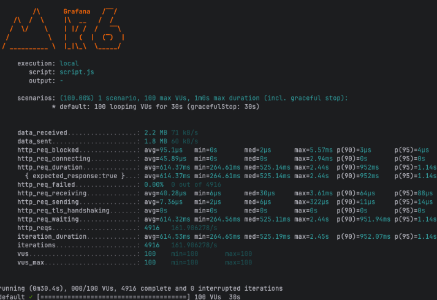
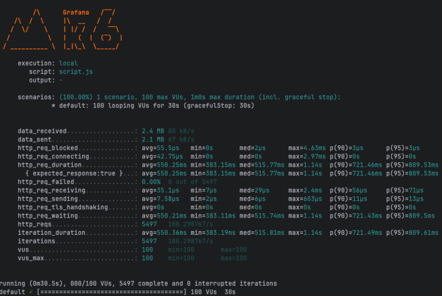
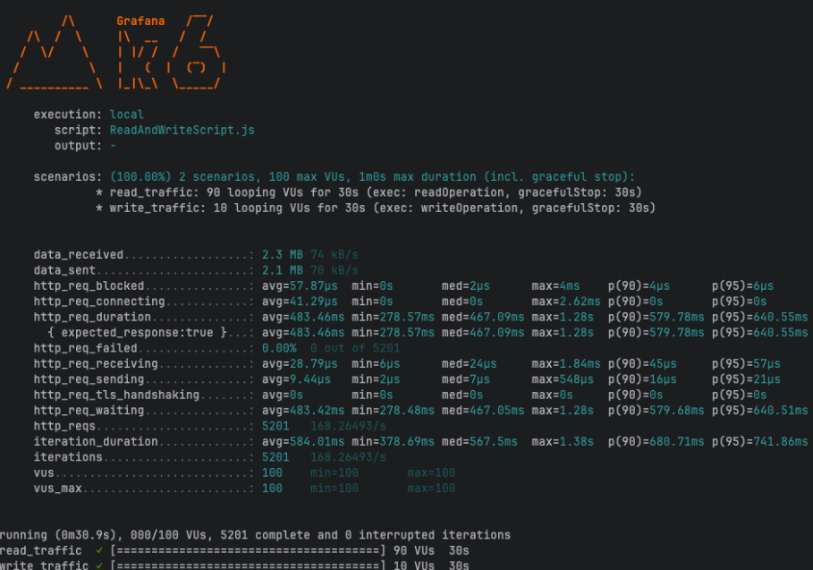
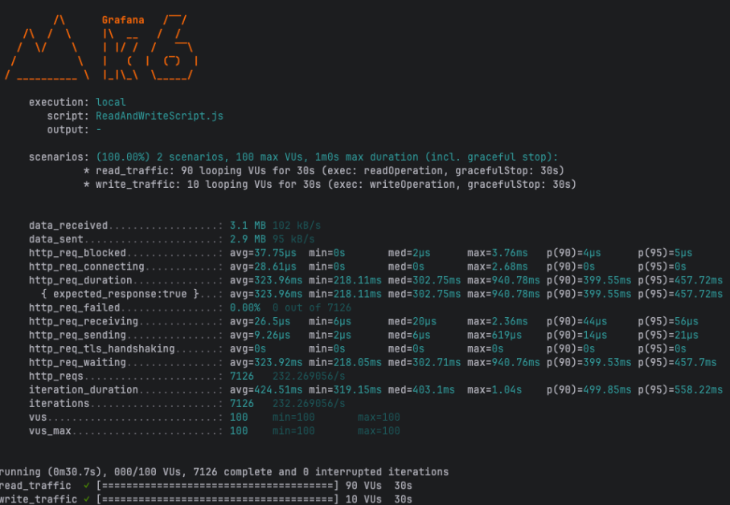

동시 접속자가 증가하면, DB에 전달되는 부하 또한 증가하게 됩니다. 아직 심각한 성능 저하를 경험하지는 못했지만,
<strong>[사내 서비스](https://u300.kr/)</strong>에 사용자가 점차 늘어나는 상황에서 단일 DB 구조의 잠재적 문제를 미리 파악해 장애를 방지해야겠다고 판단했습니다.
Clustering, Replication, Sharding 등 다양한 선택지 중 해당 프로젝트에 가장 적합한 Replication을 선택하게 되었습니다.
선택한 이유와 Replication을 적용하면서 확인한 성능 개선 결과를 공유하겠습니다.

## 😣 단일 DB의 한계

단일 DB는 모든 쓰기/읽기 요청이 한 곳에 집중되어 트래픽이 증가할 경우 성능 저하를 피할 수 없고, 장애 발생 시 전체 서비스가 중단될 수밖에 없습니다.

<strong>'그럼 성능을 올리면 되잖아?'</strong>라고 생각할 수 있지만 <strong style="color:#ee2323;">Scale-Up</strong>으로 어느 정도 버틸 수 있어도,
비용 대비 효율이 떨어지고 결국 한계에 부딪히게 됩니다.

이러한 한계를 극복하기 위해 **DB 확장 전략**을 검토하기 시작했습니다.

## 👀 프로젝트에 맞는 방법 찾기

DB 확장 전략은 다양한 방법이 존재합니다. 먼저 위에서 언급했던 <strong style="color:#ee2323;">Scale-Up(수직 확장)</strong> 그리고
<strong style="color:#006dd7;">Scale-Out(수평 확장)</strong>이 있습니다.

Scale-Up은 구조 변경 없이 서버 성능을 확장할 수 있지만 비용이 많이 들고,
물리적인 한계가 존재하기 때문에 <strong style="color:#006dd7;">Scale-Out으로 진행</strong>하게 되었습니다.

Scale-Out의 종류에는 **Replication, Clustering, Sharding**이 있고, 각각의 특징은 아래와 같습니다.

> 기술에 대해 자세히 다루는 글이 아니므로, 장/단점만 간단히 알아보겠습니다 !

### **👉🏻 Replication : Master-Slave 구조로 관리하여, 쓰기/읽기 기능 분리**

<strong style="color:#006dd7;">장점</strong> → 읽기 성능 향상, 가용성 확보, 백업 용이  
<strong style="color:#ee2323;">장점</strong> → 쓰기 성능 개선 없음, Replication Lag, 데이터 정합성

### **👉🏻 Clustering : 여러 DB를 하나의 시스템처럼 운영**

<strong style="color:#006dd7;">장점</strong> → 고가용성, 무중단 운영  
<strong style="color:#ee2323;">장점</strong> → 구성 복잡도 높음, 높은 비용, 성능 오버헤드, Lock 경합

### **👉🏻 Sharding : 데이터를 여러 DB에 분산**

<strong style="color:#006dd7;">장점</strong> → 쓰기/읽기 모두 분산, 높은 확장성, 데이터 격리  
<strong style="color:#ee2323;">장점</strong> → 구현 복잡도 매우 높음, 조인 어려움, 리샤딩 필요, 트랜잭션 제한

<strong>[사내 서비스(관리 및 평가자 서버)](https://u300.kr/)</strong>의 트래픽 패턴을 분석해보니 읽기 요청이 쓰기 요청보다 현저히 많았습니다.
이런 상황에서 Replication은 읽기 부하를 여러 Replica로 분산시켜 효과적으로 성능을 개선할 수 있습니다.
해당 프로젝트에는 DB Replication이 가장 합리적인 선택이라고 판단했습니다.

## 🔎 결과를 알아보자

결과를 먼저 간략하게 정리해보자면, 단순 읽기 작업에서는 큰 차이가 느껴지지 않았습니다.
오히려 Slave DB로 요청할 때 더 느린 결과가 나올 때도 있었습니다.
하지만 읽기와 쓰기를 동시에 요청했을 때 성능 차이를 확실하게 느낄 수 있었습니다.

  
  

**\[Master Only, Master/Slave 읽기 성능 비교\]**

    <table style="text-align:center; font-weight:bold; margin:0 auto;">
      <tr>
        <td>지표</td><td>Master Only</td><td>Master/Slave</td><td>차이</td><td>결과</td>
      </tr>
      <tr>
        <td>실패율</td><td>0.00%</td><td>0.00%</td><td>동일</td><td style="color:#888;">동일</td>
      </tr>
      <tr>
        <td>평균 응답시간</td><td>614.37ms</td><td>550.25ms</td><td style="color:#2563eb;">-64ms(-10.4%)</td><td style="color:#16a34a;">성능 개선</td>
      </tr>
      <tr>
        <td>처리량(TPS)</td><td>161.9 req/s</td><td>180.3 req/s</td><td style="color:#2563eb;">+18.4 req/s (+11.4%)</td><td style="color:#16a34a;">성능 개선</td>
      </tr>
      <tr>
        <td>총 요청 수</td><td>4,916</td><td>5,497</td><td style="color:#2563eb;">+581(+11.8%)</td><td style="color:#16a34a;">성능 개선</td>
      </tr>
    </table>

  
  

**\[Master Only, Master/Slave 읽기/쓰기 요청 결과\]**

<table style="text-align:center; font-weight:bold;">
  <tr>
    <td>지표</td><td>Master Only</td><td>Master/Slave</td><td>차이</td><td>결과</td>
  </tr>
  <tr>
    <td>실패율</td><td>0.00%</td><td>0.00%</td><td>동일</td><td style="color:#888;">동일</td>
  </tr>
  <tr>
    <td>평균 응답시간</td><td>483.46ms</td><td>323.96ms</td><td style="color:#2563eb;">-159ms(-33.0%)</td><td style="color:#16a34a;">성능 개선</td>
  </tr>
  <tr>
    <td>처리량(TPS)</td><td>168.26 req/s</td><td>232.27 req/s</td><td style="color:#2563eb;">+64 req/s (+38.0%)</td><td style="color:#16a34a;">성능 개선</td>
  </tr>
  <tr>
    <td>총 요청 수</td><td>5,201</td><td>7,126</td><td style="color:#2563eb;">+1,925(+37.0%)</td><td style="color:#16a34a;">성능 개선</td>
  </tr>
</table>

## 📝 왜 이런 결과가 나왔을까?

단순 읽기 요청만 할 때는 개선 폭이 11.4%로 제한적이었지만, 읽기/쓰기가 혼합되었을 때는 성능이 38% 개선되었습니다.
이유는 단일 DB 환경에서는 읽기와 쓰기 요청이 같은 Connection Pool을 경쟁하며 사용합니다.
쓰기 작업은 보통 트랜잭션 시간이 길고 Lock을 획득하기 때문에, 읽기 요청이 대기하는 시간이 늘어납니다.

반면 Replication을 적용하면 읽기 요청은 Slave로 분산되어 Master의 Connection Pool을 사용하지 않게 되고,
Master는 쓰기 작업에만 집중할 수 있어 Lock 경합이 감소하게 됩니다.

간단히 정리하자면 쓰기 요청이 배타 락을 획득하면 읽기 요청은 대기 상태가 되어 응답 시간이 늘어날 수 밖에 없습니다.

## 💭 마치며

문제가 생기기 전에 미리 대비하자는 목표로 시작한 Replication 적용 작업이었습니다.
테스트 결과, 혼합 트래픽 환경에서 38% 성능 개선을 확인했고, 무엇보다 향후 트래픽 증가에 대응할 수 있는 구조를 갖추게 되었습니다.

물론 완벽한 것은 아니지만 한 걸음씩 나아가다 보면 더 안정적인 서비스를 만들 수 있을 거라 생각합니다.