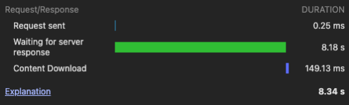
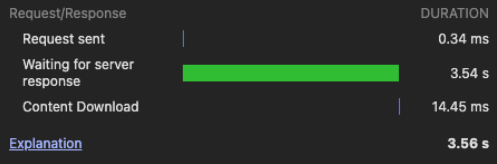
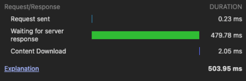

사내에서 6년간 운영해오던 사이트를 전면 리팩토링 작업 후 몇 개월간 큰 문제없이 운영되는 듯 했었는데,
데이터가 쌓이다보니 동료가 작업한 특정 페이지에서 **조회 시간이 8초 이상 소요**되는 것을 발견했습니다.

회사에서는 크게 문제 삼지 않았지만, 이런 문제들이 쌓이다 보면 분명 더 큰 문제로 다가올 수 있다고 생각했습니다.
그래서 직접 나서서 슬로우 쿼리 문제를 해결하기로 했습니다.

## 🛠️ 쿼리부터 튜닝하자

인덱스 추가, 캐시 등의 작업을 하기 전 쿼리를 효율적으로 수정하기만 해도 성능이 상당히 개선될 수 있기 때문에 우선 쿼리 작업을 수행했습니다.
아래 3가지 작업을 통해 조회 시간 <strong style="color:#006dd7;">평균 8초에서 약 3초까지 감소</strong>시킬 수 있었습니다.

### **👉🏻 불필요한 Join 제거 및 서브쿼리 개선**

<strong style="color:#ee2323;">불필요한 Join을 제거</strong>하고, 중첩된 서브쿼리를 효율적인 Join으로 변경하여 쿼리 실행 계획을 개선

### **👉🏻 Select 절 최적화**

불필요하게 모든 컬럼을 가져오는 <strong style="color:#ee2323;">SELECT *</strong> 가 다수 확인되어 실제로 사용하는 컬럼만 명시

### **👉🏻 Where 조건 순서 변경**

필터링 효율을 높이기 위해 <strong style="color:#ee2323;">데이터를 많이 걸러낼 수 있는 조건을 Where 절 앞에 배치</strong>

## 🔗 복합 인덱스 도입

쿼리 튜닝을 통해 조회 시간을 약 57% 감소시켰지만 사용자가 느끼기에 여전히 부족한 수준이라고 생각되어, 더 나은 성능을 위해 인덱스 최적화를 결정했습니다.  
비슷한 환경으로 문제 상황을 만들었습니다. 학생들의 과목별 시험 점수를 집계하여 평균을 조회하는 기능이 있고, 데이터가 누적되면서 특정 기간의 과목별 평균 점수를 조회하는 쿼리의 성능이 급격히 저하되었다고
가정하겠습니다.

> **! 사내 DB 구조를 직접 노출하기 어려워 유사한 구조의 예시 코드로 설명드리겠습니다.**

```
-- 시험 점수 테이블 (약 1000만 건)
CREATE TABLE exam_scores (
     score_id BIGINT PRIMARY KEY AUTO_INCREMENT,
     student_id BIGINT NOT NULL,
     subject_id INT NOT NULL,
     exam_date DATE NOT NULL,
     score INT NOT NULL,
     exam_type VARCHAR(20) NOT NULL, 
     status VARCHAR(20) NOT NULL, 
     created_at DATETIME
);

-- 과목 테이블 (약 500개)
CREATE TABLE subjects (
     subject_id INT PRIMARY KEY,
     subject_name VARCHAR(100),
     category VARCHAR(50), 
     created_at DATETIME
);
```

#### 📝 문제의 쿼리 및 실행 계획 분석

> 쿼리 성능 문제를 파악하기 위해 EXPLAIN으로 실행 계획을 확인

```
SELECT s.subject_name,
       s.category,
       AVG(e.score) as avg_score,
       COUNT(e.score_id) as total_count
FROM exam_scores e
JOIN subjects s ON e.subject_id = s.subject_id
WHERE e.status = 'GRADED'
  AND e.exam_type = 'FINAL'
  AND e.exam_date BETWEEN '2024-01-01' AND '2024-12-31'
  AND s.category = 'MATH'
GROUP BY s.subject_id, s.subject_name, s.category
ORDER BY avg_score DESC;
```

```
EXPLAIN SELECT 
     s.subject_name,
     s.category,
     AVG(e.score) as avg_score,
     COUNT(e.score_id) as total_count
FROM exam_scores e
JOIN subjects s ON e.subject_id = s.subject_id
WHERE e.status = 'GRADED'
  AND e.exam_type = 'FINAL'
  AND e.exam_date BETWEEN '2024-01-01' AND '2024-12-31'
  AND s.category = 'MATH'
GROUP BY s.subject_id, s.subject_name, s.category
ORDER BY avg_score DESC;

-- 결과
+----+-------+--------+------+---------------+------+---------+------+----------+----------+----------------------------------------------+
| id | type  | table  | type | possible_keys | key  | key_len | ref  | rows     | filtered | Extra                                        |
+----+-------+--------+------+---------------+------+---------+------+----------+----------+----------------------------------------------+
|  1 | SIMPLE| e      | ALL  | NULL          | NULL | NULL    | NULL | 10000000 | 1.00     | Using where; Using temporary; Using filesort |
|  1 | SIMPLE| s      | ref  | PRIMARY       | PRIMARY| 4    | e.subject_id| 1    | 10.00    | Using where                                  |
+----+-------+--------+------+---------------+------+---------+------+----------+----------+----------------------------------------------+
```

#### 🔎 문제점 발견과 해결 방안

1000만 건의 전체 데이터를 스캔하고 있고, WHERE 조건들이 인덱스를 전혀 활용하지 못하고 있었고,
**WHERE 절에서 사용되는 조건들을 조합한 복합 인덱스를 생성**하기로 했습니다.
복합 인덱스 생성 시 컬럼은 선택한 이유는 아래와 같습니다.

- status : 가장 많이 필터링 되는 조건
- exam_type : 세 가지 값중 하나로 추가 필터링
- exam_date : 범위 조건으로 마지막 동등 조건(=) 다음에 배치
- subject_id : GROUP BY에 사용되어 정렬 비용 감소

```
-- 복합 인덱스 생성
CREATE INDEX idx_scores_composite 
ON exam_scores (status, exam_type, exam_date, subject_id);

-- 개선 결과
+----+-------+--------+-------+----------------------+----------------------+---------+------+------+----------+-------------+
| id | type  | table  | type  | possible_keys        | key                  | key_len | ref  | rows | filtered | Extra       |
+----+-------+--------+-------+----------------------+----------------------+---------+------+------+----------+-------------+
|  1 | SIMPLE| e      | range | idx_scores_composite | idx_scores_composite | 120     | NULL | 8000 | 100.00   | Using where; Using index |
|  1 | SIMPLE| s      | ref   | PRIMARY              | PRIMARY              | 4       | e.subject_id| 1| 10.00 | Using where |
+----+-------+--------+-------+----------------------+----------------------+---------+------+------+----------+-------------+
```

#### 🫣 개선 효과

**스캔 row 수 :** <strong style="color:#ee2323;">10,000,000건</strong> **→** <strong style="color:#006dd7;">8,000건 (99.92% 감소)</strong>  
**조회 시간 :** <strong style="color:#ee2323;">약 5초</strong> **→** <strong style="color:#006dd7;">약 0.2초 (96% 개선)</strong>

```
-- 개선 전
Query OK, 15 rows affected (5.23 sec)

-- 개선 후
Query OK, 15 rows affected (0.18 sec)
```

## 🔭 개선된 실제 서비스 결과를 비교해보자

**결과 :** <strong style="color:#ee2323;">약 8340ms</strong> **→** <strong style="color:#006dd7;">약 3560ms</strong> **→** <strong style="color:#006dd7;">약 503ms (약 93.9% ↓)</strong>

> 이미 몇 달전 작업한 결과물로 개발자 도구를 통해 기록을 남긴점 양해부탁드리겠습니다.

<div align="center">
  

**기존 평균 응답 시간** : <strong style="color:#ee2323;">약 8340ms</strong>
</div>


<div align="center">
  

**쿼리 튜닝으로 개선된 평균 응답 시간** : <strong style="color:#006dd7;">약 3560ms</strong>
</div>


<div align="center">
  

**인덱스 추가로 개선된 평균 응답 시간** : <strong style="color:#006dd7;">약 503ms</strong>
</div>


## 💭 마치며

대단한 작업은 아니지만 이러한 작은 부분들 방지하면 언젠가는 큰 장애로 이어질 수 있다고 생각합니다. 
백엔드 개발자로서 앞으로도 사용자에게 더 나은 환경을 제공하기 위해 끈임없이 문제를 찾아 해결할 것입니다. 

인덱스, 캐시를 적용하기 전 쿼리 튜닝을 통해 충분히 최적화를 해보자. 그 이후 부족함이 느껴진다면 더 개선할 방법을 찾아보도록 합시다 !