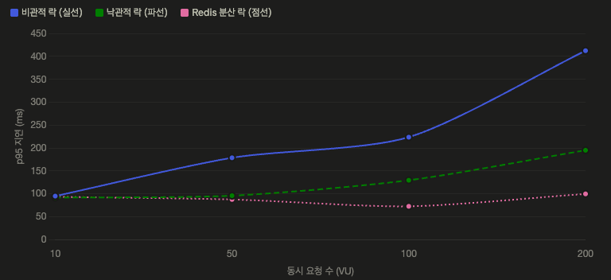

다들 티켓 예매 사이트 많이 이용하실 텐데, 좌석 선택 했을 때 "이미 선택된 좌석입니다"라는 문구 한 번쯤은 보셨을 겁니다.
인기 공연 티켓팅 날이면 수천, 수만 명이 같은 시간에 몰려서 좋은 자리를 두고 클릭 전쟁이 벌어지죠.

개발자 입장에서 여러사람이 정확히 같은 순간에 같은 좌석을 눌렀을 때, 시스템이 이걸 어떻게 처리할까요?
잘못 만들면 한 좌석을 두 명에게 판매 하는, 이른바 '중복 점유'가 발생합니다.

이번 글에서는 이 문제를 직접 마주하고, 세 가지 락(lock) 전략을 각각 구현해서 트래픽 규모별로 어떻게 다른지 비교해본 과정을 정리해봤습니다.

## 중복 선점이 왜 생길까 ?

좌석을 선점하는 로직은 보통 이렇게 세 단계로 이뤄집니다.
한 번의 요청이라면 문제가 없지만 여러 요청이 동시에 발생할 경우 문제가 발생합니다.

1. **조회** : 좌석 상태를 조회한다.
2. **검증** : 이 좌석이 선택 가능한 상태인지 확인한다.
3. **상태 변경** : 선점됨으로 바꾼다.

```
User A :  조회 ── 검증 통과 ── 선점 상태로 변경 (성공)
User B :          조회 ── 검증 통과 ── 선점 상태로 변경 (성공)
```

A가 상태를 바꾸기 전에 B가 이미 조회를 끝내버렸기 때문에, B의 눈에도 좌석은 여전히 선점 가능한 상태입니다.
결국 둘 다 검증을 통과하고, 둘 다 자기가 선점했다고 믿게 됩니다.

## 방법 1. 비관적 락 (Pessimistic Lock)

> "충돌이 자주 일어날 거야. 아예 처음부터 잠가버리자."

비관적 락은 **데이터를 읽는 순간 DB 레벨에서 락을 걸어**, 다른 트랜잭션이 그 행(row)에 접근하지 못하게 막습니다.
먼저 들어온 요청이 작업을 끝내고 커밋할 때까지, 나머지는 줄을 서서 기다립니다.

JPA에서는 `@Lock(LockModeType.PESSIMISTIC_WRITE)`로 간단히 구현할 수 있어요.
내부적으로는 `SELECT ... FOR UPDATE` 쿼리가 나갑니다.

```java

@Lock(LockModeType.PESSIMISTIC_WRITE)
@Query("SELECT s FROM seat_inventory s WHERE s.id = :id")
Optional<SeatInventory> findByIdForUpdate(@Param("id") Long id);
```

**장점**은 확실합니다. 충돌 자체를 원천 봉쇄하기 때문에 중복 점유가 절대 발생하지 않고, 로직도 직관적입니다.

**단점**은 트래픽이 커질 때 드러납니다.
모든 요청이 락을 기다리며 커넥션을 붙잡고 있기 때문에, 대기 시간이 길어지면 **커넥션 풀이 고갈**될 위험이 있습니다.
요청이 몰릴수록 줄이 길어지고, 지연도 가파르게 올라갑니다.

## 방법 2. 낙관적 락 (Optimistic Lock)

> "충돌은 어쩌다 한 번일 거야. 일단 진행하고, 부딪히면 그때 처리하자."

낙관적 락은 아예 락을 걸지 않습니다. 대신 엔티티에 **버전(version) 컬럼**을 두고,
업데이트 시점에 내가 읽었던 버전이랑 지금 버전이 같은지를 확인합니다.
그 사이 누군가 먼저 값을 바꿨다면 버전이 올라가 있을 테고, 그러면 `OptimisticLockException`이 터집니다.

```java

@Entity
public class SeatInventory {
    @Id
    private Long id;

    @Version
    private Long version;

    @Enumerated(EnumType.STRING)
    private SeatStatus status;
}
```

충돌이 나면 예외가 발생하니까, 보통은 이렇게 **재시도** 로직으로 감싸줍니다.

```java

@Retryable(
        retryFor = OptimisticLockException.class,
        maxAttempts = 3,
        backoff = @Backoff(delay = 50)
)
@Transactional
public void reserveSeat(Long seatId, Long userId) {
    Seat seat = seatRepository.findById(seatId)
            .orElseThrow(SeatNotFoundException::new);
    if (seat.getStatus() != SeatStatus.AVAILABLE) {
        throw new SeatAlreadyTakenException();
    }
    seat.occupy(userId);
}
```

**장점**은 커넥션을 오래 붙잡지 않고, 락을 걸지 않으니 충돌이 드문 상황에선 매우 빠르다는 점입니다.

**단점**은 정반대 상황에서 나옵니다. **같은 좌석에 요청이 몰리면 충돌이 잦아지고, 그만큼 재시도가 폭증**합니다.
재시도가 재시도를 부르면서 오히려 부하가 커지는 역효과가 생겨요. 인기 좌석 하나에 수백 명이
달려드는 티켓팅 상황은 낙관적 락에게 꽤 불리한 조건인 셈이죠.

## 방법 3. Redis 분산 락 (Distributed Lock)

> "DB까지 가기 전에, 앞단에서 미리 걸러내자."

앞의 두 방법은 결국 **DB에서** 경합을 처리합니다.
Redis 분산 락은 요청이 DB에 닿기 **전에** Redis에서 락을 잡습니다.
좌석 하나당 락 키를 하나 두고, 그 락을 잡은 요청만 통과시키는 거예요.

Redisson 라이브러리를 쓰면 이렇게 구현할 수 있습니다.

```java
public void reserveSeat(Long seatId, Long userId) {
    RLock lock = redissonClient.getLock("seat:lock:" + seatId);
    try {
        // waitTime 3초, leaseTime 1초
        boolean acquired = lock.tryLock(3, 1, TimeUnit.SECONDS);
        if (!acquired) {
            throw new SeatLockAcquisitionException();
        }
        // 락을 잡은 요청만 여기 진입 → 안전하게 선점 처리
        reservationService.reserve(seatId, userId);
    } 
    ...
}
```

**장점**은 경합을 DB 바깥에서 끝낸다는 점입니다.
DB 커넥션을 오래 잡고 대기할 필요도, 재시도로 부하를 키울 필요도 없습니다.
무엇보다 애플리케이션 서버를 여러 대로 늘리는 **스케일 아웃 환경에서도 인메모리 락과 달리 서버 간 정합성이 보장**됩니다.

**단점**이라면 Redis라는 인프라 의존성이 하나 늘어나고, 락 획득/해제 과정에서 네트워크 왕복 비용이 생긴다는 점입니다.
락 만료 시간(TTL) 설정도 신중해야 합니다.

## 성능 비교: 동시 요청 수를 늘려가며

동시 사용자 수(VU: Virtual User)를 10 → 50 → 100 → 200으로 늘려가며 **p95 지연 시간**을 측정해봤습니다.
p95는 "전체 요청 중 95%가 이 시간 안에 처리됐다"는 지표로, 체감 성능을 잘 보여줍니다.

| 동시 요청 수 (VU) |  비관적 락  |  낙관적 락  | Redis 분산 락 |
|:------------:|:-------:|:-------:|:----------:|
|      10      | 약 95ms  | 약 90ms  |   약 90ms   |
|      50      | 약 180ms | 약 95ms  |   약 85ms   |
|     100      | 약 220ms | 약 128ms |   약 70ms   |
|     200      | 약 410ms | 약 195ms |   약 98ms   |

그래프로 보면 차이가 더 극명합니다.

<div align="center">
  
</div>

- **비관적 락(파란 실선)** : 요청이 몰릴수록 지연이 가장 가파르게 치솟습니다. VU 200에서는 400ms를 넘겼고 모두가 락을 기다리며 줄을 서기 때문에 트래픽에 정비례해 대기가 길어지는 전형적인
  패턴입니다.
- **낙관적 락(초록 파선)** : 비관적 락보다는 완만하지만, 동시 요청이 늘수록 재시도 부담이 쌓이며 꾸준히 우상향합니다.
- **Redis 분산 락(분홍 점선)** : 가장 인상적입니다. VU가 늘어도 지연이 거의 평평하게 유지되고, 200 VU에서도 100ms 안쪽을 지켜냅니다.

핵심은 **부하가 커질 때 세 방식의 격차가 벌어진다**는 점입니다.
트래픽이 적을 땐 세가지 방법 모두 비슷하지만, 티켓팅처럼 순간 트래픽이 폭발하는 상황일수록 선택에 따라 결과가 달라졌습니다.

## 결국 어떤 선택을 했을까요 ?

저는 최종적으로 **Redis 분산 락**을 선택했습니다. 이유는 세 가지로 정리됩니다.

1. **비관적 락의 커넥션 풀 고갈 위험** : 락 대기가 곧 커넥션 점유로 이어져, 트래픽이 커질수록 시스템 전체가 흔들릴 수 있었습니다.
2. **낙관적 락의 재시도 폭증** : 인기 좌석에 요청이 몰리는 티켓팅 특성상, 충돌이 잦아 재시도가 부하를 키우는 구조가 부담스러웠습니다.
3. **스케일 아웃 적합성** : 경합을 DB 이전 단계에서 차단하기 때문에, 서버를 여러 대로 늘리는 확장 전략과 잘 맞았습니다.

물론 "무조건 Redis 분산 락이 정답"이라는 얘기는 아닙니다.
충돌이 드문 도메인이라면 낙관적 락이 더 간결하고, 인프라를 최소화하고 싶다면 비관적 락도 충분히 합리적인 선택일 수 있습니다.
**트래픽 패턴과 충돌 빈도, 확장 계획**을 함께 놓고 봐야 답이 나옵니다.

## 💭 마치며

이번 프로젝트에서 얻은 가장 큰 배움은, 동시성 문제에 정해진 정답이 있는 게 아니라
상황별 트레이드오프를 직접 측정해서 근거를 만드는 과정이었습니다.
좌석 하나 안 겹치게 하려고 시작한 고민이, 결국 시스템을 어떻게 확장할 것인가에 대한 질문으로 이어졌습니다.