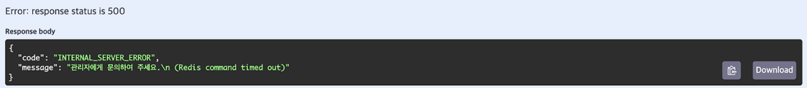
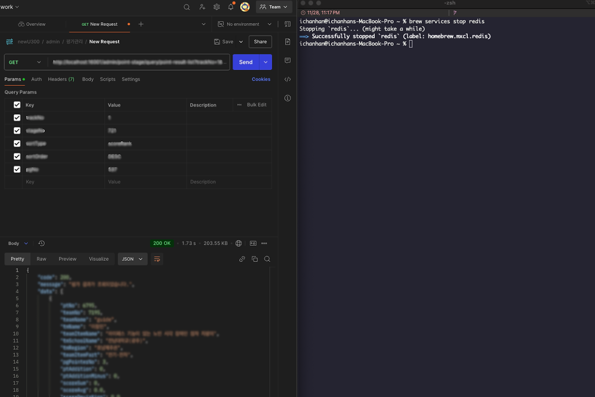

여느 때처럼 사내 프로젝트를 진행하던 중, 문득 <strong style="color:#ee2323;">'Redis에 장애가 발생하면 캐싱된 데이터를 요청하는 API는 어떻게 될까?'</strong>라는 생각이 스쳐
지나갔습니다.
TimeOut이 발생할지, 즉시 에러를 반환할지, 다른 방식으로 처리될지 궁금해졌습니다. 궁금증을 해소하기 위해 직접 확인해보기로 했습니다.

## 🚫 Redis 서버에 장애 상황을 연출해보자

Redis 서버에 장애 상황을 만들기 위해 직접 Redis 서버를 종료 시키고 API를 호출한 뒤 어떤 일이 발생하는지 직접 확인해봤습니다.

<div align="center">
  
</div>

결과는 예상대로, TimeOut이 발생했습니다.
매 요청마다 Redis 연결을 시도하고, 연결에 실패하면 설정된 TimeOut 시간만큼 기다린 후 에러를 반환했습니다.
사용자 입장에서는 몇 초간 응답 없이 기다리다 결국 데이터를 받지 못하는 상황이 발생하는 것입니다.

## 🤔 서킷브레이커는 오버스펙 아니야?

오버스펙 맞습니다🥲 오버스펙임에도 불구하고 서킷브레이커 패턴을 적용시킨 이유는 조금 뒤에 설명하겠습니다.
일반적으로 이런 상황에서는 Try-Catch로 예외 처리하고 DB로 Fallback하는 방법이 보편적이라고 알고 있습니다.
하지만 이 방식은 매 요청마다 타임아웃 시간만큼 대기해야 하는 문제가 있습니다.

<strong>'그럼 TimeOut 시간을 짧게 설정하면 되는 거 아니야?'</strong>라고 생각할 수 있지만
TimeOut 시간을 짧게 설정하더라도 매 요청마다 Redis로 연결을 시도하면서 발생하는 리소스 낭비는 여전히 남아있습니다.

서킷브레이커 패턴은 일반적으로 외부 API 호출이나 MSA 환경같은 장애 전파 위험이 큰 환경에서 사용됩니다.
현재는 Redis 캐싱이라는 비교적 단순한 구조지만, 아래와 같은 이유로 도입을 결정했습니다.

### **👉🏻 응답 시간 개선**

매 요청마다 발생하는 타임아웃 대기를 제거하여 <strong style="color:#006dd7;">사용자 경험 개선</strong>

### **👉🏻 자동 복구**

주기적인 Redis 복구 시도로 장애 해소 시 <strong style="color:#006dd7;">자동 전환</strong>

### **👉🏻 시스템 리소스 보호**

반복적인 Redis 연결 시도를 차단해 <strong style="color:#006dd7;">불필요한 리소스 낭비 방지</strong>

## 🆚 Resilience4j vs Hystrix

서킷브레이커 패턴을 왜 선택했는지 알아봤으니, 어떤 라이브러리를 사용했는지 알아보겠습니다.  
선택지는 **Resilience4j와 Hystrix** 두 가지였습니다.
두 라이브러리의 결정적인 차이는 Hystrix는 유지보수가 중단되었고, 현재 프로젝트 환경인 Spring Boot 3.x와 호환되지 않았습니다.
반면 Resilience4j는 꾸준한 유지보수와 Spring Boot 3.x에서 호환된다는 장점으로 인해 <strong style="color:#006dd7;">Resilience4j</strong>를 선택하게 되었습니다.

## ⚙️ 서킷브레이커 설정하고, 정상 흐름을 만들어보자

라이브러리를 선택한 뒤 다음 고민은 **'구체적인 설정을 어떻게 구성하면 좋을까?'** 였습니다.
실패율의 임계값, Half-Open 전환 시간 등 각 설정값이 동작 방식을 결정하기 때문에 목적에 맞게 선택했습니다.

**👉🏻 실패율 임계값 : 50%**

<strong style="color:#006dd7;">빠른 장애 감지</strong>를 위해 실패율을 50%로 설정

**👉🏻 Half-Open 전환 시간 : 30초**

Redis 재시작 또는 네트워크 복구 시 일반적으로 수십 초가 걸리기 때문에 너무 짧으면 복구되지 않은 상태에서 계속 시도하게 되고,
너무 길면 복구되었는데도 DB를 계속 사용하게됩니다. 30초는 <strong style="color:#006dd7;">빠른 복구와 불필요한 시도 방지 사이의 균형점</strong>이라고 판단

**👉🏻 Half-Open 테스트 횟수 : 5번**

Half-Open 상태에서 5번의 테스트 호출을 시도 후 절반 이상 성공하면 Circuit을 닫고, 실패율이 높으면 다시 Open 상태로 변경

```yaml
resilience4j:
  circuitbreaker:
    configs:
      default:
        sliding-window-type: COUNT_BASED
        sliding-window-size: 1
        minimum-number-of-calls: 1
        failure-rate-threshold: 50
        wait-duration-in-open-state: 30s
        automatic-transition-from-open-to-half-open-enabled: true
        permitted-number-of-calls-in-half-open-state: 5
```

## 🔎 실제 결과를 확인해보자

설정을 완료한 뒤 Redis를 종료 시키고 캐싱 데이터를 요청하는 API를 호출했습니다.
결과는 서킷브레이커가 정상적으로 작동하여, **TimeOut 대기 없이 즉시 DB로 전환되었고, 데이터를 정상적으로 반환**했습니다.

<div align="center">
  
</div>

## 💭 마치며

Redis 장애 상황에 대비하기 위해 서킷브레이커 패턴을 도입했습니다.
'서킷브레이커 패턴을 도입하는 것이 오버스펙은 아닐까?'라는 의문이 들었지만,
실제로 적용해보니 사용자 경험을 개선하고 자동 복구 메커니즘을 구축할 수 있었습니다.

장애는 언제든 발생할 수 있고, 작은 시스템이라도 **장애 상황을 미리 재현하여 대응 방법**을 경험해본 저에게 값진 경험이었습니다.