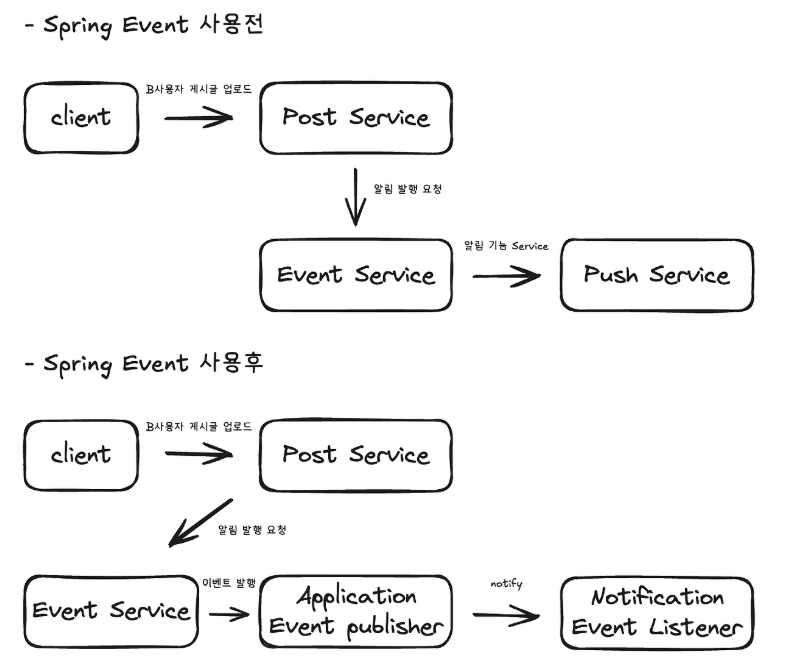
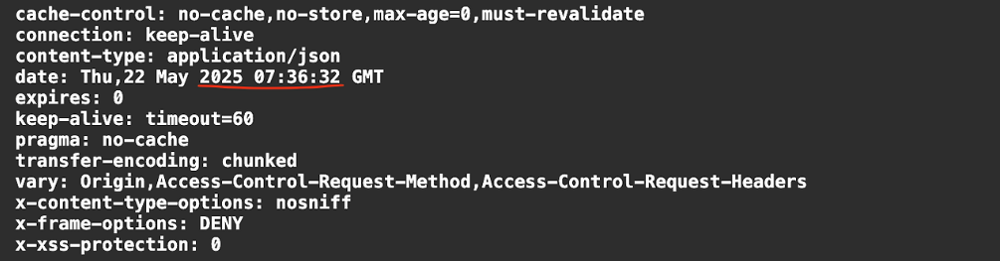
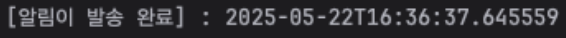
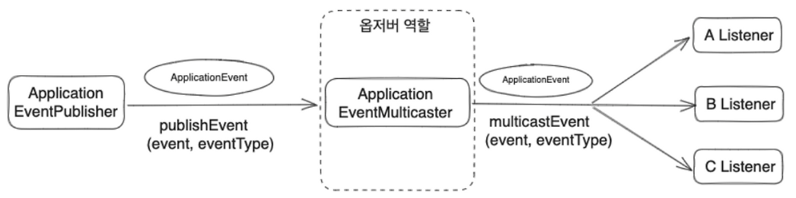
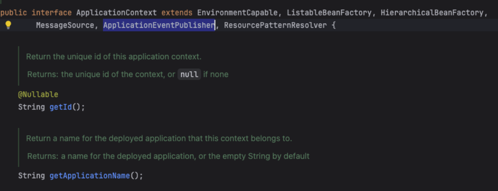
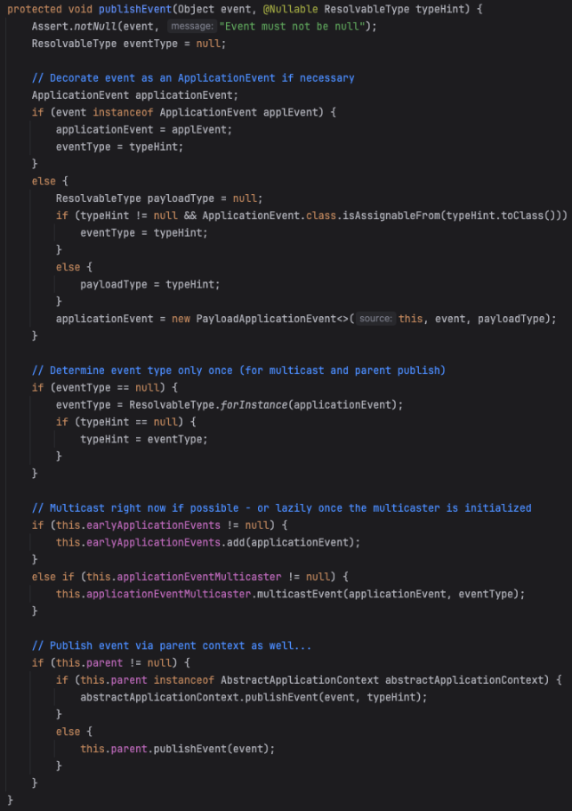
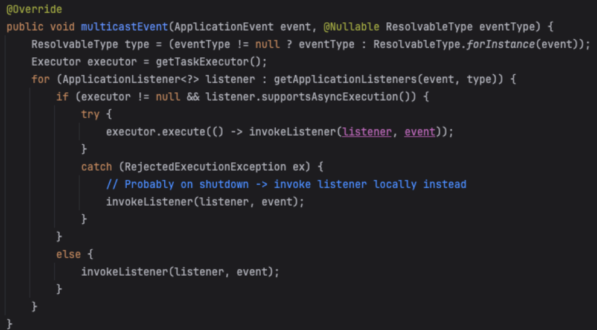
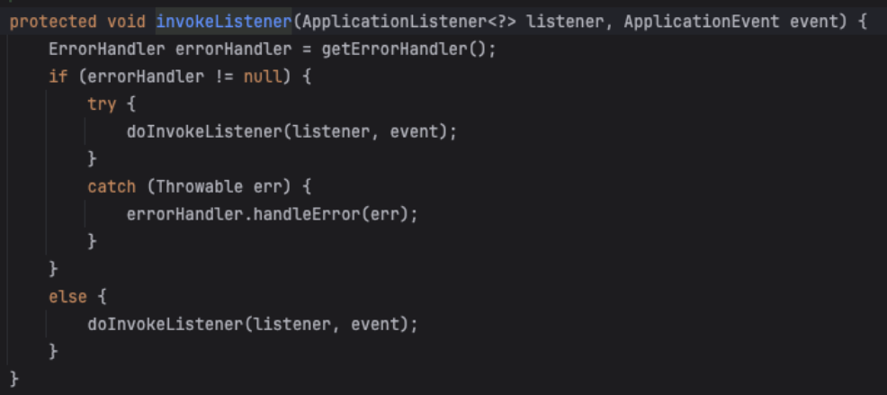
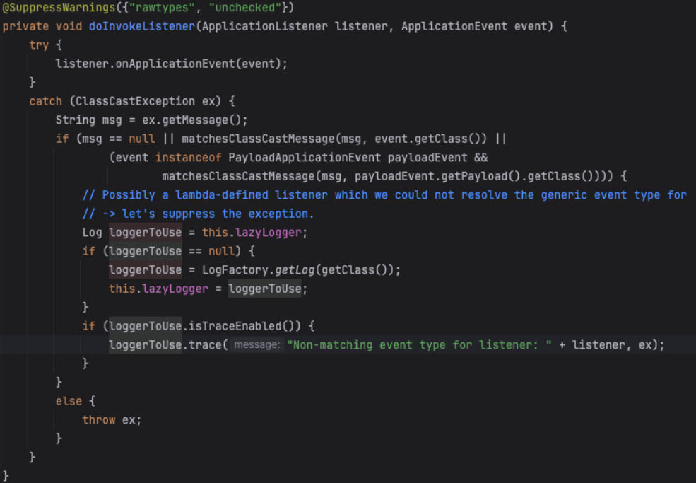

## ❓이벤트(Event)와 Spring Boot 이벤트의 이해

먼저 프로그래밍에서 **이벤트**란, 애플리케이션 내에서 발생시킬 수 있는 어떤한 **사건이나 상태 변경 등**을 의미한다.
애플리케이션에는 어떠한 이벤트를 발생시키는 주체와 정해진이벤트의 발생을 탐지해 동작을 처리하는 주체가 존재할 수 있다.

Spring Boot는 이벤트 처리를 위해 **ApplicationEvent** 클래스와 **ApplicationEventPublisher** 인터페이스를 제공한다.  
Spring에서 발생하는 모든 이벤트는 **ApplicationEvent** 클래스를 상속하여 정의되며,
이벤트를 발생시킬 때 전달되고, **ApplicationEventPublisher**는 이벤트를 발생시키고 이벤트를 구독하는 리스너에게 전달하는 역할을 합니다.
Spring Context에서 주입하여 사용할 수 있으며, **publishEvent()** 메서드를 통해 이벤트를 발행할 수 있다.

### 언제 이벤트를 사용할까 ?

개발을 하는 과정에서 어느 시점에서 Spring Boot 이벤트를 적용할 수 있을지 알아보자.  
먼저 특정 동작을 수행하는 과정에서 그 동작과는 개별적으로 추가 수행을 해야하는 경우,
그 외적인 동작을 처리하기 위한 이벤트를 발생 시키고, 발생한 이벤트를 처리하는 로직에서 필요한 동작을 수행할 수 있다.

## 🚀 Spring Boot Event 적용하기

- [SNS] A사용자가 B사용자를 팔로우 중
- B사용자가 새로운 게시글 업로드
- A사용자에게 B사용자의 게시글 업로드 되었음을 알림 발행 후 전달

<div align="center">
  
</div>

## 🧑🏻‍💻 주요 코드 설명

### PostEvent

``` java
public record PostEvent(Post post) {}
```

### Event Publisher

``` java
@Service
@RequiredArgsConstructor
@Transactional(readOnly = true)
@Slf4j
public class DefaultPostService implements PostService {
    private final ApplicationEventPublisher eventPublisher;

    @Overrid
    @Transactional
    public void addPost(requestDto request) {
        // ...게시글 등록 로직
        
        // savePost = 저장한 게시글 정보
        PostEvent postEvent = new PostEvent(savePost);
        eventPublisher.publishEvent(postEvent);
    }
}
```

### NotificationEventListener

``` java
@Component
@RequiredArgsConstructor
@Slf4j
public class NotificationEventListener {

    @Async
    @TransactionalEventListener(phase = TransactionPhase.AFTER_COMMIT)
    public void issueNotify(PosEvent postEvent) {
        Thread.sleep(5000);
        // ... 발송 로직 추가
        log.info("[알림이 발송 완료] : {}", LocalDateTime.now());
    }
}
```

<div align="center">
  

API 반환 결과
</div>

<div align="center">
  

알림 발송 결과
</div>

- 기본적으로 Spring Event는 동기 방식으로 작동하지만 예제 코드는 비동기 방식으로 구현했다.
- 비동기 처리는 @Async와 ApplicationMain클래스에 @EnableAsync를 사용하면 된다.
- 비동기 결과 확인을 위해 이벤트 발행 시 쓰레드를 5초 sleep한 뒤 결과를 확인했다.  
  API 반환 시간은 32초, 알림 발송은 37초에 발송된 것을 확인할 수 있다.(시간은 UTC 반영으로 인해 오차가 있다.)
- 기본적으로 동기 방식은 하나의 트랜잭션의 범위로 묶을 수 있으나, 비동기 방식으로 동작할 경우 이벤트 발행 전의 로직과 후의 로직이 하나의 트랜잭션으로 묶일 수 없다.  
  따라서 정밀하게 트랜잭션을 사용하는 경우라면 꼭 이러한 부분을 고려해봐야한다.
- Spring 4.2부터는 @EventListener을 확장한 @TransacitionEventListener를 제공하고 있으며, 아래와 같은 옵션이 존재한다.  
  예제의 경우 TransactionPhase.AFTER\_COMMIT를 사용했다.
    - TransactionPhase.AFTER\_COMMIT : 트랜잭션이 커밋되기 직전에 실행
    - TransactionPhase.AFTER\_COMPLETION : 트랜잭션 커밋 완료 후 실행(성공 시)
    - TransactionPhase.BEFORE\_COMMIT :트랜잭션 롤백 완료 후 실행
    - TransactionPhase.AFTER\_ROLLBACK : 트랙잭션 커밋 또는 롤백 완료 후 실행

## 👀 Spring Event 동작 원리 알아보기

<div align="center">
  
</div>

Spring Event에 대한 참고 자료를 여럿 찾아보던 중**Application Context**가 왜 지속적으로 언급되는지 궁금했다

상단의 이미지를 보면 ApplicationEventPulisher의 이벤트를 발행한 뒤 ApplicationEventMulticaster에 의해 
구독된 이벤트 리스너들을 호출한다. 상세하게 코드를 따라가보자

1. ApplicationContext를 보니 ApplicationEventPublisher를 상속 받고 있었고,
ApplicationContext를 주입 받아 publishEvent메서드를 사용할 수 있던
것이였다. 하지만 명시적으로 ApplicationEventPublisher를 주입받는 것이 더 명확하고, 
다른 개발자들도 이해하기 쉽고, ApplicationContext 주입 시 과도한 권한(컨텍스트 전체 접근)을 방지할 수 있다.

<div align="center">
  
</div>

2. **AbstractApplicationContext**는 ApplicationContext 인터페이스의 구현체로 이벤트를 발행할 때 사용했던 
publishEvent의 구체적인 로직을 구현한다. 일반 객체를 ApplicationEvent로 타입을 변환하고, 
ApplicationEventMulticaster를 통해 이벤트 브로드캐스팅(동시 전달)을 한다.

<div align="center">
  
</div>

3. SimpleApplicationEventMulticaster에 구현되어있는 multicastEvent를 통해 등록된 모든 리스너를 찾아 이벤트를 전파한다.
ApplicationListener 빈 중에서 이벤트 타입과 @EventListener의 조건을 만족하는 리스너만 선택되어 호출한다.

<div align="center">
  
</div>

4. 이벤트 리스너들이 호출되는 과정으로 에러가 발생하지 않는다면, listener.onApplicationEvent를 호출하여 이벤트를 실행한다.

<div align="center">
  
  
</div>

## 📝 정리와 느낀점

Spring Event를 사용했을 때의 장점은 **두 도메인 간의 의존성을 완전히 분리**할 수 있다는 것이다. 
서로 다른 도메인끼리 존재를 몰라도 되기 때문에 느슨하게 결합되고, 재사용성도 높아진다.  
위 예제에서 Spring Event를 사용하지 않고 하나의 서비스에서 모두 처리했을 경우 알림 발송에 실패하면 분명 게시글 작성도 Rollback 될 것이다. 
궁금했던 부분을 해소하려 하나하나 디버깅하면서 많은 공부를 했고, 오늘도 나의 자산이 생겼다 !