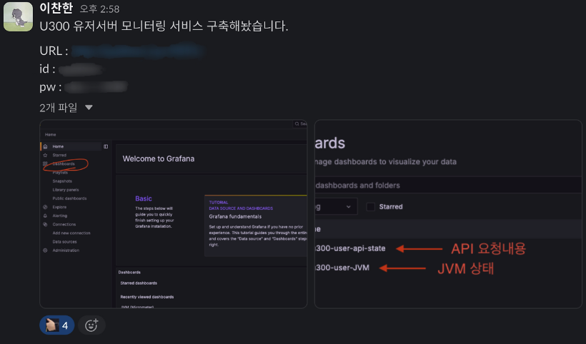

2025년 들어 기술블로그 글을 많이 올리지 못했다. 이유는 내가 작성한 글을 돌아볼 때마다 게시글의 내용이 알차지 못하고, 정리 정돈이 되어있지 않다고 느껴졌다.  
글을 썼다 지우고 썼다 지우고, 임시저장 되어있는 글이 수두룩하다.

어떻게 정리해야 가독성이 좋고, 어떤 레퍼런스를 참고해서 공부를 해야되는지 다른 분들의 기술블로그를 보면서 기록하는 방법에 대해 열심히 공부하고 있다.  
이 회고글도 임시저장 목록에 그대로 쌓일지, 등록할지는 잘 모르겠다.

## ☀️ 2025년

### 기획과 설계의 결과물 1월

6년간 이어오던 느릿느릿한 ASP로 만든 사이트를 걷어내고 리팩토링하기 위해 8월부터 몇 달간 기획과 설계를 했다.
운영중인 서비스라 유지보수하면서 기획하고, 다른 사이트도 운영하고 이런 저런 상황에 기획과 설계의 속도가 빠르지는 않았던 것 같다.  
2024년 11월에 들어와서야 기능 개발을 시작할 수 있었다. 클라이언트와의 소통 미흡으로 인해 개발 중간중간 기획이 계속 바뀌어 만들어 놓은 로직을 바꾸는 일도 빈번했다.  
그래도 같이 으쌰으쌰할 수 있는 팀원들이 있어서 즐거운 1월을 보낼 수 있었다.

### 프로젝트 마무리가 다가오는 2월

다행이 일정에 맞춰 프로젝트는 이상없이 마무리될 수 있었다.  
남은 건 테스트와 테스트...또 테스트..........생각하지 못했던 곳에서 오류가 많이 발생했다.  
꽤나 규모있는 프로젝트에 백엔드는 혼자 맡아서 진행했기 때문에 기획이 자꾸 바뀌면서 기존에 만들어 놓았던 코드까지 예외처리 못한 부분이 있었다.(앞으로는 2번 3번 훑어보기 !)

### 다양한 경험을한 3월

여태까지와는 다르게 올해부터는 리팩토링한 사이트와 모든 대학교이 제휴를 맺어 사이트의 사용자 수가 몇배는 더 증가할 예정 이라는 얘기를 들었다.
작성한 코드와 쿼리는 모두 최적화 해놨지만 트래픽이 많이 몰리면 '서버와 모니터링은 어떻게하지 ?' 라는 걱정이 들이 시작했다.  
내가 아는 선까지의 최적화는 해놨지만 많은 이슈들이 생길 것 같아 이슈를 조금이라도 줄여보기 위해 이것저것 찾아가며 프로젝트 고도화를 진행하기 시작했다.

먼저 <strong style="color:#ee2323;">Redis 캐싱 도입</strong>. Redis로 회원관리, 중복 로그인 방지 등 간단한 정보 저장에만 사용하고 있었다.  
빈번하게 조회되고, 반환되는 데이터의 크기가 큰 API의 경우 Redis 캐시로 관리하기로 했다.
당연히 결과는 성공적 ! 단언컨데 속도는 10배 이상 빨라졌다.(이제 캐시 없으면 못살아~)  
데이터가 변경됐을 때 Redis에 캐싱되어있는 데이터 무효화하는 로직 추가하는 것까지 잊지 않았다.

데이터를 캐시로 관리하면서 '만약 Redis에 장애가 생기면 어떻게 되는거지 ?' 라는 생각이 들어서 Redis를 강제로 종료 시키고 다시 API를 요청해봤다.
역시 API 반환을 할 수 없어 Time out 오류까지 발생했다.  
장애를 전파방지하기 위해 <strong style="color:#ee2323;">Circuitbreaker를 도입</strong>했다. 덕분에 Redis에 장애가 발생해도 정상적으로 작동할 수 있도록 완성했다.

마지막으로 <strong style="color:#ee2323;">트래픽 관리 모니터링 시스템 도입.</strong> 사용자가 많아지면 당연히 관리해야 할 로그도 많아지고,
의도치 않은 오류와 악의적인 시도가 있을 수 있다. 이를 모니터링하기 위해 Prometheus와 Grafana를 활용해 모니터링 시스템을 구축했다.
어느 API에서 몇번 오류가 발생했는지, 어느 API를 가장 많이 요청했는지, JVM의 메모리는 얼마나 사용 중인지 등 많은 데이터를 시각화해서 볼 수 있다는 점에서 뿌듯했다.

  

엄지좀 더 눌러주세요.......

## 📝 2025년 앞으로의 목표

### 딥다이브하는 힘을 길러보자

학습하는데 있어 얕은 지식이 아닌 근본적인 원인과 본질을 파악할 수 있는 나만의 딥다이브 방식을 찾아서 몸에 익혀보자.  
지금까지는 일단 구현하고 시간이 될 때 하나하나 따라가보면서 동작 원리를 찾았다면, 앞으로는 시간에 구애받지 않고 어떻게 동작하는 찾아보고 따라가보려고 한다.

### 구글링 보다는 도큐먼트를 먼저보자

모르는게 있으면 먼저 구글링부터 한다. 그래도 모르겠으면 프롬프트를 열어 검색을 한다. 물론 나쁜 습관은 아니지만 개발자가 분명 도큐먼트에 친절하게 작성해놨는데 왜 남이쓴 게시글부터 찾아보고 있지? 라는 의문이
생겼다.  
만약 내가 찾는 정보를 포스팅한 글이 없을 땐 뭘 봐야되는 걸까....벌써 앞이 깜깜하다.  
그래서 앞으로 필요한 정보가 있으면 도큐먼트부터 찾아보는 습관을 만들어야겠다.

### 삶의 긍정적인 에너지를 줄 수 있는 취미 꾸준히하자

지금 하고 있는 개발자라는 직업과 개발을 하는 일은 정말 재밌고, 긍정적인 영향을 주지만 개발 외적인 부분에서도 자기 개발할 수 있는 취미를 꾸준하게 하려고한다.  
작년부터 일본어를 배우고 있다. 1~3개월 동안 업무도 바쁘고, 준비할 것도 있어서 잠시 소홀히 했지만 다시 나의 취미 활동도 열심히 해보자 ! 頑張りましょ~~

⭐️ 잘해보자 2025 ! ⭐️

  

