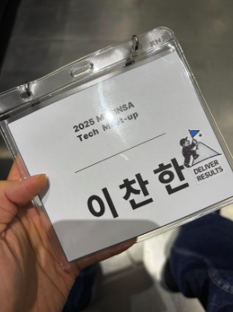
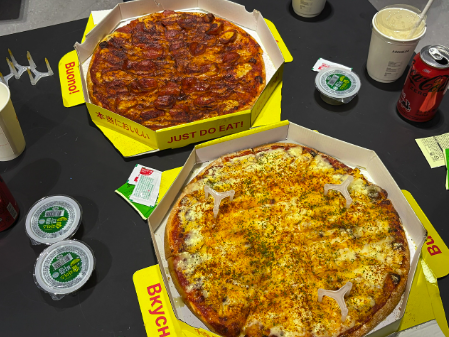

평소 무신사를 많이 이용하는 저는 무신사 밋업 신청 글을 보자마자 망설임 없이 '신청하기' 버튼을 눌러 버렸습니다. 
감사하게도 선정되어 개발자 인생 처음으로 밋업 참여 기회를 얻게 되었습니다.

이번 밋업은 무신사의 비전과 앞으로의 방향성 그리고 무신사 Engineering을 이루고 있는 각 팀의 성격과 팀의 역할을 소개하는 시간이었습니다. 
(발표에 너무 집중해서 메모를 못해, 기억나는 내용만 작성 하겠습니다🥲)

  

## 💭 기억에 남는 발표 내용

#### 무신사의 비전과 성장

요즘 경제가 좋지 않아 실적이 부진할 거라는 예상과는 달리, 무신사는 오히려 꾸준한 매출 증가세를 보이고 있다고 합니다. 
저는 단순히 운이 좋아서가 아니라, 고객 경험 개선과 플랫폼 안정성을 위해 끊임없이 노력해온 수많은 직원들의 성과라고 생각합니다.

인상 깊었던 점은 무신사가 국내 시장에 안주하지 않고 글로벌 시장 진출을 적극적으로 준비하고 있다는 것이었습니다. 
발표를 들으며 내부적으로 정말 많은 고민과 도전이 이루어지고 있다는 것을 느낄 수 있었습니다. 
글로벌 시장에서의 경쟁력을 키우면, 분명 국내 시장의 경쟁력으로도 이어질 것이라고 생각합니다.

#### Engineering 팀 소개

이번 밋업에서는 무신사의 다양한 Engineering 팀들이 소개되었습니다. 
클레임개발팀, 전시개발팀 등 각 팀이 어떤 역할을 하고, 어떤 기술적 과제를 해결하고 있는 지를 직접 들을 수 있었습니다.

저는 클레임개발팀에 대해 처음으로 알게 되었습니다. 
이름만 듣고 "고객의 민원을 처리하는 팀인가?"라고 생각했지만, 실제로는 주문 완료 이후 일어나는 모든 일들을 책임지는 팀이었습니다. 
발표를 너무 잘 해주셔서 새로 알게 된 클레임개발팀에 호기심을 갖게 되었습니다. 
교환, 반품, 환불 등의 프로세스에서 예상하지 못한 상황들을 처리하는 과정들이 생각보다 훨씬 복잡하고 사용자의 관점에서 고려해야할 사항이 많다고 느껴졌습니다.

## 🧑‍🧑‍🧒 네트워킹

발표가 끝난 이후 네트워킹 시간이 마련되어 있었습니다. 
네트워킹은 스탠딩으로 진행되었고, 피자🍕를 먹으며 각 팀의 팀장님들께서 돌아다니시며, 편안한 분위기에 질의응답 시간을 가졌습니다.

발표 때 가장 흥미로웠던 클레임개발팀 팀장님께서 네트워킹 시간에도 열정적으로 설명해주셔서 클레임개발팀에 대해 이야기를 더 들을 수 있었습니다. 
현업에서 실제 마주했던 경험을 말씀해주셨고, 들으면 들을 수록 흥미가 더 커졌습니다.

문득 어렸을 적 큐브를 처음 접했을 때가 떠올랐습니다. 
처음엔 아무것도 모르고 무작정 돌리다가, 완성하고 싶어져서 공식을 하나씩 외워가던 그때처럼, 
개발도 결국 복잡해 보이는 문제를 작은 단위로 나누고 체계적으로 접근하면 해결할 수 있다는 것을 다시 한번 깨달았습니다.

살짝 아쉬웠던 부분은 네트워킹 시간이 여유있지 않았다는 점입니다🥲 
저녁 시간에 진행되는 프로그램이다보니 어쩔 수 없을 것 같다고 생각했습니다.

  

## 📝 느낀점

이번 밋업을 통해 무신사가 생각하는 고민과 뱡향성을 직접 듣고 느낄 수 있었습니다. 
특히 각 팀이 맡은 도메인에서 깊이 있게 고민하고 문제를 해결해나가는 모습이 인상적이었습니다.

개발자로서 처음 참여한 밋업이었지만, 팀장님들의 이야기를 들으며 많은 것을 배웠고, 
무엇보다 네트워킹을 통해 같은 길을 걷는 개발자들과 소통하고, 다양한 관점을 접할 수 있었던 것이 가장 좋았습니다. 
앞으로도 이런 자리가 많이 마련되었으면 좋겠습니다.

마지막으로 좋은 자리, 좋은 시간 마련해주신 무신사 임직원분들에게 감사인사드립니다.
